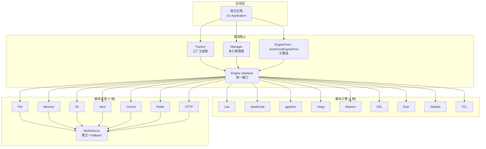
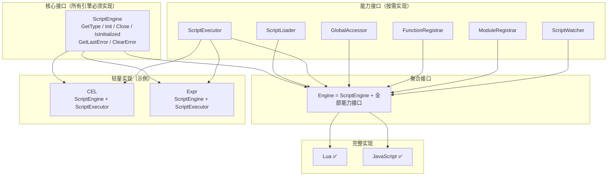

# Go Scripts · 多语言嵌入式脚本引擎框架

[](LICENSE) [](https://golang.org) [](https://pkg.go.dev/github.com/tx7do/go-scripts)

**为 Go 应用打造的一站式多语言脚本引擎框架**

让宿主程序以统一接口无缝嵌入 9 种脚本语言，以扩展运行时行为、实现热插拔逻辑与快速原型开发

[中文](README.md) · [English](README_EN.md) · [日本語](README_JP.md)

---

## 项目亮点

- **九大引擎，能力接口**：Lua、JavaScript、Python (gpython)、Go (Yaegi)、WebAssembly (Wazero)、CEL、Expr、Starlark、TCL —— 按能力拆分的小接口（`ScriptEngine` / `ScriptLoader` / `ScriptExecutor` / ...），完整引擎聚合为 `Engine`，轻量引擎按需实现
- **零 CGO 依赖**：全部引擎均为纯 Go 实现，跨平台编译开箱即用，容器化部署无额外开销
- **生产级引擎池**：内置固定大小池 (`EnginePool`) 与自动扩容池 (`AutoGrowEnginePool`)，支持高并发脚本执行
- **多租户引擎管理**：`Manager` 组件提供命名空间隔离的多引擎生命周期管理
- **多源脚本加载**：File、Memory、S3、etcd、Consul、Redis、HTTP、MultiSource（Fallback / FirstOK 双策略聚合）
- **热更新**：实现 `ScriptWatcher` 的引擎支持 `StartWatch` / `StopWatch`，脚本变更自动重载，零停机发布
- **宿主互操作**：全局变量注入、Go 函数注册、模块注册、脚本函数回调，双向数据桥接
- **线程安全**：双锁模式 (`RWMutex` + `execMutex`) + Context 取消机制，保障并发场景下的数据一致性

---

## 什么是 Go Scripts？

Go Scripts 是一个 **可扩展的嵌入式脚本引擎框架**，为 Go 应用程序提供统一的脚本执行层。它解决了以下核心问题：

- **语言碎片化**：不同场景需要不同脚本语言（规则引擎用 CEL、业务逻辑用 Python、快速验证用 JavaScript），但每种语言的嵌入方式各异
- **生命周期管理**：脚本引擎的初始化、预热、池化、并发控制、优雅关闭，需要大量样板代码
- **脚本来源多样化**：本地文件、对象存储、配置中心、内存注入 —— 不同来源需要不同的加载策略
- **热更新需求**：线上脚本逻辑需要不停机更新，传统的"编译-部署"循环无法满足快速迭代

> Go Scripts 的设计哲学是：**一套接口，多语言支持；一个框架，覆盖从开发到生产的全生命周期**。

---

## 脚本引擎

| 引擎 | 类型常量 | 底层库 | 语言版本 | 适用场景 |
| --- | --- | --- | --- | --- |
| **Lua** | `LuaType` | [gopher-lua](https://github.com/yuin/gopher-lua) | Lua 5.1 | 游戏脚本、配置逻辑、嵌入式扩展 |
| **JavaScript** | `JavaScriptType` | [goja](https://github.com/dop251/goja) | ES5.1+ (ES6 子集) | 前端复用、规则引擎、快速原型 |
| **Python** | `GPythonType` | [gpython](https://github.com/go-python/gpython) | Python 3.4 子集 | 数据处理、运维脚本、算法验证 |
| **Go** | `YaegiType` | [Yaegi](https://github.com/traefik/yaegi) | Go 1.x | 动态插件、DevOps 工具链 |
| **WebAssembly** | `WazeroType` | [wazero](https://github.com/tetratelabs/wazero) | WASM 1.0 | 高性能沙箱、跨语言模块复用 |
| **CEL** | `CELType` | [cel-go](https://github.com/google/cel-go) | CEL spec | 策略引擎、权限规则、条件判断 |
| **Expr** | `ExprType` | [expr](https://github.com/expr-lang/expr) | Expr DSL | 业务表达式、模板引擎、数据筛选 |
| **Starlark** | `StarlarkType` | [starlark-go](https://github.com/google/starlark-go) | Starlark (Python 方言) | 构建工具、安全脚本、Bazel 规则 |
| **TCL** | `TclType` | [modernc/tcl](https://pkg.go.dev/modernc.org/tcl) | TCL 8.6 | 传统系统兼容、网络设备脚本 |

---

## 系统架构



---

## 接口架构

Go Scripts 采用**接口隔离原则 (ISP)** 设计引擎接口，与 source 模块的 `Reader` / `Watcher` / `ReadWatcher` 分离哲学一致：



| 接口 | 方法 | 说明 |
| --- | --- | --- |
| `ScriptEngine` | GetType / Init / Close / IsInitialized / GetLastError / ClearError | **核心**：所有引擎必须实现 |
| `ScriptLoader` | SetSource / GetSource / Load / LoadMulti / LoadString | **能力**：源驱动脚本加载 |
| `ScriptExecutor` | Execute / ExecuteFromKey / ExecuteFromKeys / ExecuteString | **能力**：脚本执行 |
| `GlobalAccessor` | RegisterGlobal / GetGlobal | **能力**：全局变量读写 |
| `FunctionRegistrar` | RegisterFunction / CallFunction | **能力**：函数注册与调用 |
| `ModuleRegistrar` | RegisterModule | **可选**：模块系统 |
| `ScriptWatcher` | StartWatch / StopWatch | **可选**：热更新监听 |
| `Engine` | （聚合上述全部） | **聚合**：Lua / JavaScript 等完整引擎 |

> 调用方通过 `AsLoader(eng)`、`AsWatcher(eng)` 等辅助函数或类型断言检测引擎是否支持特定能力。

---

## 核心功能

### 引擎管理

| 功能 | 说明 |
| --- | --- |
| 工厂模式 | `NewScriptEngine(typ)` 按类型创建引擎，通过 `init()` 自动注册 |
| 引擎管理器 | `Manager` 支持按名称注册、查找、批量初始化/关闭 |
| 引擎池 | `EnginePool`（固定大小）+ `AutoGrowEnginePool`（自动扩容） |
| 生命周期 | `Init` → `Load` / `Execute` → `Close`，状态机式管理 |

### 脚本加载与执行

| 功能 | 说明 |
| --- | --- |
| 多源加载 | File、Memory、S3、etcd、Consul、Redis、HTTP 七种来源 |
| 聚合策略 | `MultiSource` 支持 Fallback（顺序回退）和 FirstOK（并发择快） |
| 执行模式 | `Execute`（批量执行）、`ExecuteFromKey`（按 key 加载+执行）、`ExecuteString`（内联执行） |
| 全局变量 | `RegisterGlobal` / `GetGlobal` 宿主与脚本双向变量桥接 |
| 函数互调 | `RegisterFunction`（Go → 脚本）、`CallFunction`（脚本 → Go） |
| 模块注册 | `RegisterModule` 注册自定义模块供脚本 `require` / `import` |

### 热更新

| 功能 | 说明 |
| --- | --- |
| 变更监听 | `StartWatch` / `StopWatch` 通过 Source 的 Watcher 接口监听变更 |
| 自动重载 | 脚本变更后自动重新加载并编译，无需重启 |
| 事件驱动 | etcd 原生 Watch、File mtime 轮询、S3 ETag 比对、Memory 内嵌通知 |

---

## 技术栈

| 层级 | 技术 | 说明 |
| --- | --- | --- |
| 语言 | Go 1.24+ | 高性能编译型语言 |
| 架构模式 | 接口驱动 + 工厂模式 | 可扩展、可替换 |
| 并发模型 | goroutine + channel + sync | 双锁模式保障线程安全 |
| 热更新 | Watcher 接口 + context.CancelFunc | 事件驱动 + 资源回收 |
| 测试覆盖 | testify + httptest + 700+ test cases | 单元测试 + 集成测试 |

---

## 项目结构

```
go-scripts/
├── engine.go                     # 能力接口 + Engine 聚合接口 + 辅助函数
├── factory.go                    # 工厂注册表
├── manager.go                    # 多引擎管理器
├── engine_pool.go                # 固定大小引擎池
├── engine_pool_autogrow.go       # 自动扩容引擎池
├── types.go                      # 类型常量定义
├── source/                       # 脚本来源模块
│   ├── source.go                 # Reader / Watcher / ReadWatcher 接口
│   ├── file.go                   # 本地文件源
│   ├── fs.go                     # io/fs.FS 源 (embed / zip)
│   ├── memory.go                 # 内存源
│   ├── multiple.go               # 多源聚合 (Fallback / FirstOK)
│   ├── transform.go              # 解密/解压/过滤中间件
│   ├── cached.go                 # 缓存层 (TTL + Watch 自动失效)
│   ├── s3/                       # Amazon S3 / 兼容对象存储
│   ├── etcd/                     # etcd KV
│   ├── consul/                   # Consul KV
│   ├── redis/                    # Redis
│   ├── http/                     # HTTP 远程拉取
│   ├── git/                      # Git 仓库 (go-git/v6)
│   └── database/                 # SQL 数据库 (database/sql)
├── lua/                          # Lua 引擎 (gopher-lua)
├── javascript/                   # JavaScript 引擎 (goja)
├── gpython/                      # Python 引擎 (gpython)
├── yaegi/                        # Go 引擎 (Yaegi)
├── wazero/                       # WebAssembly 引擎 (wazero)
├── cel/                          # CEL 表达式引擎 (cel-go)
├── expr/                         # Expr 表达式引擎 (expr-lang)
├── starlark/                     # Starlark 引擎 (starlark-go)
└── tcl/                          # TCL 引擎 (modernc/tcl)
```

---

## 快速开始

### 安装

```bash
go get github.com/tx7do/go-scripts
```

### 基础用法

```go
package main

import (
    "context"
    "fmt"
    "log"

    scriptEngine "github.com/tx7do/go-scripts"
    _ "github.com/tx7do/go-scripts/javascript" // 注册 JavaScript 引擎
)

func main() {
    // 1. 创建引擎实例
    eng, err := scriptEngine.NewScriptEngine(scriptEngine.JavaScriptType)
    if err != nil {
        log.Fatal(err)
    }
    defer eng.Close()

    // 2. 初始化
    ctx := context.Background()
    if err := eng.Init(ctx); err != nil {
        log.Fatal(err)
    }

    // 3. 注入宿主变量
    _ = eng.RegisterGlobal("name", "world")

    // 4. 注册宿主函数
    _ = eng.RegisterFunction("greet", func(name string) string {
        return fmt.Sprintf("Hello, %s!", name)
    })

    // 5. 执行脚本
    result, err := eng.ExecuteString(ctx, "hello.js", `greet(name)`)
    if err != nil {
        log.Fatal(err)
    }
    fmt.Println(result) // Hello, world!
}
```

### 引擎池（生产推荐）

```go
// 固定大小引擎池（8 实例）
pool, err := scriptEngine.NewEnginePool(8, scriptEngine.LuaType)

// 或：自动扩容池（初始 2，上限 16）
pool, err := scriptEngine.NewAutoGrowEnginePool(2, 16, scriptEngine.LuaType)
if err != nil {
    log.Fatal(err)
}
defer pool.Close()

// 注入宿主函数（注：仅作用于被 Acquire 的实例）
_ = pool.RegisterFunction("calc", func(a, b int) int { return a + b })

// 执行脚本
result, _ := pool.ExecuteString(ctx, "calc.lua", `return calc(10, 20)`)
```

### 配合 ScriptSource

```go
// 从本地文件加载
src := source.NewFileSource()
eng.SetSource(src)

// 从文件执行
result, _ := eng.ExecuteFromKey(ctx, "/path/to/script.lua")

// S3 + Memory Fallback
s3Src, _ := s3source.New(ctx, "my-bucket", s3source.WithRegion("us-east-1"))
memSrc := source.NewMemSource()
memSrc.Set("backup.lua", `print("fallback")`)

multi, _ := source.NewFallbackSource(s3Src, memSrc)
eng.SetSource(multi)
```

### 热更新

```go
// 启动监听
if err := eng.StartWatch(ctx, "/path/to/script.lua"); err != nil {
    log.Fatal(err)
}
// 文件变更时自动重载，无需手动干预

// 停止监听
_ = eng.StopWatch("/path/to/script.lua")
```

---

## 测试

```bash
# 运行所有子模块测试
cd lua && go test -v ./...
cd javascript && go test -v ./...
cd cel && go test -v ./...
cd expr && go test -v ./...
cd starlark && go test -v ./...
cd gpython && go test -v ./...
cd yaegi && go test -v ./...
cd wazero && go test -v ./...
cd tcl && go test -v ./...
```

测试覆盖：

| 类别 | 用例 |
| --- | --- |
| 生命周期 | Init / Close / IsInitialized |
| 脚本加载 | Load / LoadMulti / LoadString |
| 脚本执行 | Execute / ExecuteFromKey / ExecuteFromKeys / ExecuteString |
| 宿主互操作 | RegisterGlobal / GetGlobal / RegisterFunction / CallFunction / RegisterModule |
| 热更新 | StartWatch / StopWatch |
| 并发压测 | 50+ goroutine × 200 loop 并发执行 |
| Source 集成 | FileSource 端到端 / MemSource / MultiSource |
| 引擎池 | Acquire / Release / InitAll / Close |

---

## 相关文档

### 脚本引擎

- [Lua 引擎文档](lua/README.md)
- [JavaScript 引擎文档](javascript/README.md)
- [gpython 引擎文档](gpython/README.md)
- [Yaegi (Go) 引擎文档](yaegi/README.md)
- [Wazero (WebAssembly) 引擎文档](wazero/README.md)
- [CEL 引擎文档](cel/README.md)
- [Expr 引擎文档](expr/README.md)
- [Starlark 引擎文档](starlark/README.md)
- [TCL 引擎文档](tcl/README.md)

### 脚本来源

- [Source 核心模块文档](source/README.md)
- [S3 Source 文档](source/s3/README.md)
- [etcd Source 文档](source/etcd/README.md)
- [Consul Source 文档](source/consul/README.md)
- [Redis Source 文档](source/redis/README.md)
- [HTTP Source 文档](source/http/README.md)
- [Git Source 文档](source/git/README.md)
- [Database Source 文档](source/database/README.md)

### 外部资源

- [Go Reference](https://pkg.go.dev/github.com/tx7do/go-scripts)

## License

[MIT License](LICENSE)
