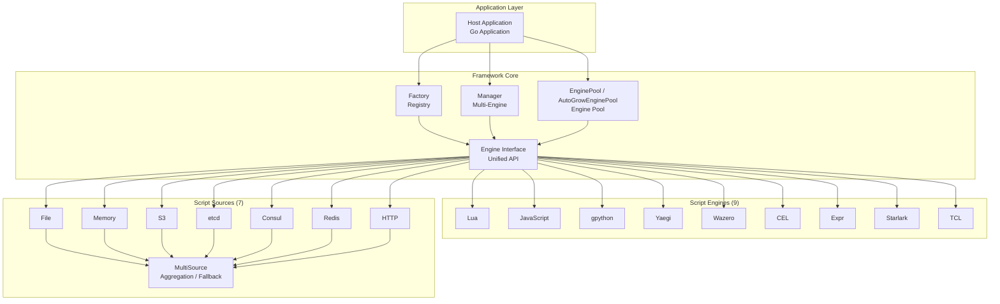

# Go Scripts · Multi-Language Embedded Scripting Engine Framework

[](LICENSE) [](https://golang.org) [](https://pkg.go.dev/github.com/tx7do/go-scripts)

**A one-stop multi-language scripting engine framework for Go applications**

Empower host programs to seamlessly embed 9 scripting languages through a unified interface, extending runtime behavior, enabling hot-pluggable logic and rapid prototyping.

[中文](README.md) · [English](README_EN.md) · [日本語](README_JP.md)

---

## Highlights

- **Nine Engines, Capability Interfaces**: Lua, JavaScript, Python (gpython), Go (Yaegi), WebAssembly (Wazero), CEL, Expr, Starlark, TCL — capability-split small interfaces (`ScriptEngine` / `ScriptLoader` / `ScriptExecutor` / ...), full engines aggregate into `Engine`, lightweight engines implement only what they need.
- **Zero CGO Dependencies**: All engines are pure-Go implementations, cross-platform compilation out of the box, zero extra overhead for containerized deployment.
- **Production-Grade Engine Pool**: Built-in fixed-size pool (`EnginePool`) and auto-scaling pool (`AutoGrowEnginePool`) for high-concurrency script execution.
- **Multi-Tenant Engine Management**: The `Manager` component provides namespace-isolated lifecycle management for multiple engines.
- **Multi-Source Script Loading**: File, Memory, S3, etcd, Consul, Redis, HTTP, and `MultiSource` (Fallback / FirstOK dual-strategy aggregation).
- **Hot Reload**: Engines implementing `ScriptWatcher` support `StartWatch` / `StopWatch` — automatic script reload on change, zero-downtime deployment.
- **Host Interoperation**: Global variable injection, Go function registration, module registration, script function callbacks — bidirectional data bridging.
- **Thread Safety**: Dual-lock pattern (`RWMutex` + `execMutex`) + Context cancellation ensures data consistency in concurrent scenarios.

---

## What is Go Scripts?

Go Scripts is an **extensible embedded scripting engine framework** that provides a unified script execution layer for Go applications. It addresses the following core challenges:

- **Language Fragmentation**: Different scenarios call for different scripting languages (CEL for rule engines, Python for business logic, JavaScript for rapid validation), yet each language has a different embedding approach.
- **Lifecycle Management**: Engine initialization, warm-up, pooling, concurrency control, and graceful shutdown require substantial boilerplate code.
- **Diverse Script Sources**: Local files, object storage, configuration centers, in-memory injection — different sources need different loading strategies.
- **Hot Reload Requirements**: Production script logic must be updatable without downtime; the traditional "compile → deploy" loop cannot keep up with fast iteration.

> The design philosophy of Go Scripts: **One interface, many languages; one framework, full lifecycle from development to production**.

---

## Script Engines

| Engine | Type Constant | Underlying Library | Language Version | Use Cases |
| --- | --- | --- | --- | --- |
| **Lua** | `LuaType` | [gopher-lua](https://github.com/yuin/gopher-lua) | Lua 5.1 | Game scripts, config logic, embedded extensions |
| **JavaScript** | `JavaScriptType` | [goja](https://github.com/dop251/goja) | ES5.1+ (ES6 subset) | Frontend reuse, rule engines, rapid prototyping |
| **Python** | `GPythonType` | [gpython](https://github.com/go-python/gpython) | Python 3.4 subset | Data processing, ops scripts, algorithm validation |
| **Go** | `YaegiType` | [Yaegi](https://github.com/traefik/yaegi) | Go 1.x | Dynamic plugins, DevOps toolchain |
| **WebAssembly** | `WazeroType` | [wazero](https://github.com/tetratelabs/wazero) | WASM 1.0 | High-performance sandbox, cross-language module reuse |
| **CEL** | `CELType` | [cel-go](https://github.com/google/cel-go) | CEL spec | Policy engines, permission rules, conditional logic |
| **Expr** | `ExprType` | [expr](https://github.com/expr-lang/expr) | Expr DSL | Business expressions, template engines, data filtering |
| **Starlark** | `StarlarkType` | [starlark-go](https://github.com/google/starlark-go) | Starlark (Python dialect) | Build tools, safe scripting, Bazel rules |
| **TCL** | `TclType` | [modernc/tcl](https://pkg.go.dev/modernc.org/tcl) | TCL 8.6 | Legacy system integration, network device scripting |

---

## System Architecture



---

## Interface Architecture

Go Scripts applies the **Interface Segregation Principle (ISP)** to engine design, consistent with the `Reader` / `Watcher` / `ReadWatcher` separation in the source module:

| Interface | Methods | Description |
| --- | --- | --- |
| `ScriptEngine` | GetType / Init / Close / IsInitialized / GetLastError / ClearError | **Core**: all engines must implement |
| `ScriptLoader` | SetSource / GetSource / Load / LoadMulti / LoadString | **Capability**: source-driven script loading |
| `ScriptExecutor` | Execute / ExecuteFromKey / ExecuteFromKeys / ExecuteString | **Capability**: script execution |
| `GlobalAccessor` | RegisterGlobal / GetGlobal | **Capability**: global variable read/write |
| `FunctionRegistrar` | RegisterFunction / CallFunction | **Capability**: function registration and invocation |
| `ModuleRegistrar` | RegisterModule | **Optional**: module system |
| `ScriptWatcher` | StartWatch / StopWatch | **Optional**: hot-reload watching |
| `Engine` | (aggregates all of the above) | **Aggregate**: Lua / JavaScript and other full engines |

> Callers use helper functions like `AsLoader(eng)`, `AsWatcher(eng)` or type assertions to check whether an engine supports a specific capability.

---

## Core Features

### Engine Management

| Feature | Description |
| --- | --- |
| Factory Pattern | `NewScriptEngine(typ)` creates engines by type, auto-registered via `init()` |
| Engine Manager | `Manager` supports named registration, lookup, batch init/shutdown |
| Engine Pool | `EnginePool` (fixed size) + `AutoGrowEnginePool` (auto-scaling) |
| Lifecycle | `Init` → `Load` / `Execute` → `Close`, state-machine based management |

### Script Loading & Execution

| Feature | Description |
| --- | --- |
| Multi-Source Loading | File, Memory, S3, etcd, Consul, Redis, HTTP — seven sources |
| Aggregation Strategy | `MultiSource` supports Fallback (sequential) and FirstOK (concurrent fastest) |
| Execution Modes | `Execute`, `ExecuteFromKey` (key-based load+execute), `ExecuteString` (inline) |
| Global Variables | `RegisterGlobal` / `GetGlobal` — bidirectional host-script bridging |
| Function Interop | `RegisterFunction` (Go → script), `CallFunction` (script → Go) |
| Module Registration | `RegisterModule` to register custom modules for `require` / `import` |

### Hot Reload

| Feature | Description |
| --- | --- |
| Change Watching | `StartWatch` / `StopWatch` — listens for changes via Source's Watcher interface |
| Auto Reload | Scripts are automatically reloaded and recompiled on change, no restart needed |
| Event-Driven | etcd native Watch, File mtime polling, S3 ETag comparison, Memory in-process notify |

---

## Tech Stack

| Layer | Technology | Description |
| --- | --- | --- |
| Language | Go 1.24+ | High-performance compiled language |
| Architecture | Interface-driven + Factory pattern | Extensible, replaceable |
| Concurrency | goroutine + channel + sync | Dual-lock pattern for thread safety |
| Hot Reload | Watcher interface + context.CancelFunc | Event-driven + resource recycling |
| Test Coverage | testify + httptest + 700+ test cases | Unit + integration testing |

---

## Project Structure

```
go-scripts/
├── engine.go                     # Capability interfaces + Engine aggregate + helper functions
├── factory.go                    # Factory registry
├── manager.go                    # Multi-engine manager
├── engine_pool.go                # Fixed-size engine pool
├── engine_pool_autogrow.go       # Auto-scaling engine pool
├── types.go                      # Type constant definitions
├── source/                       # Script source modules
│   ├── source.go                 # Reader / Watcher / ReadWatcher interfaces
│   ├── file.go                   # Local file source
│   ├── fs.go                     # io/fs.FS source (embed / zip)
│   ├── memory.go                 # In-memory source
│   ├── multiple.go               # Multi-source aggregation (Fallback / FirstOK)
│   ├── transform.go              # Decrypt / decompress / filter middleware
│   ├── cached.go                 # Cache layer (TTL + Watch auto-invalidation)
│   ├── s3/                       # Amazon S3 / compatible object storage
│   ├── etcd/                     # etcd KV
│   ├── consul/                   # Consul KV
│   ├── redis/                    # Redis
│   ├── http/                     # HTTP remote fetch
│   ├── git/                      # Git repository (go-git/v6)
│   └── database/                 # SQL database (database/sql)
├── lua/                          # Lua engine (gopher-lua)
├── javascript/                   # JavaScript engine (goja)
├── gpython/                      # Python engine (gpython)
├── yaegi/                        # Go engine (Yaegi)
├── wazero/                       # WebAssembly engine (wazero)
├── cel/                          # CEL expression engine (cel-go)
├── expr/                         # Expr expression engine (expr-lang)
├── starlark/                     # Starlark engine (starlark-go)
└── tcl/                          # TCL engine (modernc/tcl)
```

---

## Quick Start

### Installation

```bash
go get github.com/tx7do/go-scripts
```

### Basic Usage

```go
package main

import (
    "context"
    "fmt"
    "log"

    scriptEngine "github.com/tx7do/go-scripts"
    _ "github.com/tx7do/go-scripts/javascript" // Register the JavaScript engine
)

func main() {
    // 1. Create an engine instance
    eng, err := scriptEngine.NewScriptEngine(scriptEngine.JavaScriptType)
    if err != nil {
        log.Fatal(err)
    }
    defer eng.Close()

    // 2. Initialize
    ctx := context.Background()
    if err := eng.Init(ctx); err != nil {
        log.Fatal(err)
    }

    // 3. Inject host variables
    _ = eng.RegisterGlobal("name", "world")

    // 4. Register host functions
    _ = eng.RegisterFunction("greet", func(name string) string {
        return fmt.Sprintf("Hello, %s!", name)
    })

    // 5. Execute a script
    result, err := eng.ExecuteString(ctx, "hello.js", `greet(name)`)
    if err != nil {
        log.Fatal(err)
    }
    fmt.Println(result) // Hello, world!
}
```

### Engine Pool (Recommended for Production)

```go
// Fixed-size engine pool (8 instances)
pool, err := scriptEngine.NewEnginePool(8, scriptEngine.LuaType)

// Or auto-scaling pool (initial 2, max 16)
pool, err := scriptEngine.NewAutoGrowEnginePool(2, 16, scriptEngine.LuaType)
if err != nil {
    log.Fatal(err)
}
defer pool.Close()

// Inject host functions (note: applies only to acquired instances)
_ = pool.RegisterFunction("calc", func(a, b int) int { return a + b })

// Execute script
result, _ := pool.ExecuteString(ctx, "calc.lua", `return calc(10, 20)`)
```

### Working with ScriptSource

```go
// Load from local file
src := source.NewFileSource()
eng.SetSource(src)

// Execute from file
result, _ := eng.ExecuteFromKey(ctx, "/path/to/script.lua")

// S3 + Memory Fallback
s3Src, _ := s3source.New(ctx, "my-bucket", s3source.WithRegion("us-east-1"))
memSrc := source.NewMemSource()
memSrc.Set("backup.lua", `print("fallback")`)

multi, _ := source.NewFallbackSource(s3Src, memSrc)
eng.SetSource(multi)
```

### Hot Reload

```go
// Start watching
if err := eng.StartWatch(ctx, "/path/to/script.lua"); err != nil {
    log.Fatal(err)
}
// Scripts are auto-reloaded on change — no manual intervention required

// Stop watching
_ = eng.StopWatch("/path/to/script.lua")
```

---

## Testing

```bash
# Run tests for all submodules
cd lua && go test -v ./...
cd javascript && go test -v ./...
cd cel && go test -v ./...
cd expr && go test -v ./...
cd starlark && go test -v ./...
cd gpython && go test -v ./...
cd yaegi && go test -v ./...
cd wazero && go test -v ./...
cd tcl && go test -v ./...
```

Test coverage:

| Category | Test Cases |
| --- | --- |
| Lifecycle | Init / Close / IsInitialized |
| Script Loading | Load / LoadMulti / LoadString |
| Script Execution | Execute / ExecuteFromKey / ExecuteFromKeys / ExecuteString |
| Host Interop | RegisterGlobal / GetGlobal / RegisterFunction / CallFunction / RegisterModule |
| Hot Reload | StartWatch / StopWatch |
| Concurrency Stress | 50+ goroutines × 200 loops concurrent execution |
| Source Integration | FileSource end-to-end / MemSource / MultiSource |
| Engine Pool | Acquire / Release / InitAll / Close |

---

## Related Documentation

### Script Engines

- [Lua Engine Documentation](lua/README_EN.md)
- [JavaScript Engine Documentation](javascript/README_EN.md)
- [gpython Engine Documentation](gpython/README_EN.md)
- [Yaegi (Go) Engine Documentation](yaegi/README_EN.md)
- [Wazero (WebAssembly) Engine Documentation](wazero/README_EN.md)
- [CEL Engine Documentation](cel/README_EN.md)
- [Expr Engine Documentation](expr/README_EN.md)
- [Starlark Engine Documentation](starlark/README_EN.md)
- [TCL Engine Documentation](tcl/README_EN.md)

### Script Sources

- [Source Core Module Documentation](source/README_EN.md)
- [S3 Source Documentation](source/s3/README_EN.md)
- [etcd Source Documentation](source/etcd/README_EN.md)
- [Consul Source Documentation](source/consul/README_EN.md)
- [Redis Source Documentation](source/redis/README_EN.md)
- [HTTP Source Documentation](source/http/README_EN.md)
- [Git Source Documentation](source/git/README_EN.md)
- [Database Source Documentation](source/database/README_EN.md)

### External Resources

- [Go Reference](https://pkg.go.dev/github.com/tx7do/go-scripts)

## License

[MIT License](LICENSE)
