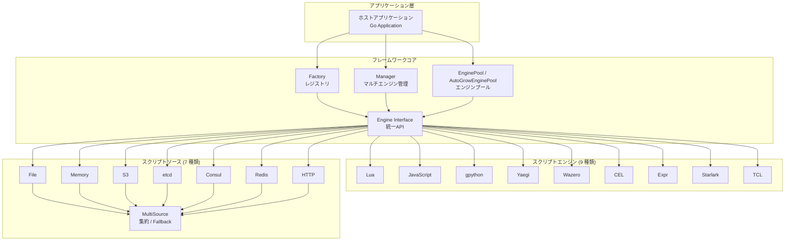

# Go Scripts · マルチ言語組み込みスクリプトエンジンフレームワーク

[](LICENSE) [](https://golang.org) [](https://pkg.go.dev/github.com/tx7do/go-scripts)

**Go アプリケーションのためのワンストップ・マルチ言語スクリプトエンジンフレームワーク**

ホストプログラムが統一インターフェースで 9 種類のスクリプト言語をシームレスに組み込み、ランタイムの振る舞いを拡張、ホットプラグ可能なロジックと迅速なプロトタイピングを実現します。

[中文](README.md) · [English](README_EN.md) · [日本語](README_JP.md)

---

## ハイライト

- **9 つのエンジン、機能インターフェース**: Lua、JavaScript、Python (gpython)、Go (Yaegi)、WebAssembly (Wazero)、CEL、Expr、Starlark、TCL —— 機能ごとに分割された小インターフェース（`ScriptEngine` / `ScriptLoader` / `ScriptExecutor` / ...）、完全エンジンは `Engine` に集約、軽量エンジンは必要なもののみ実装
- **ゼロ CGO 依存**: すべてのエンジンがピュア Go 実装、クロスプラットフォームコンパイルがすぐに利用可能、コンテナ化デプロイも追加オーバーヘッドなし
- **本番グレードのエンジンプール**: 内蔵の固定サイズプール (`EnginePool`) とオートスケーリングプール (`AutoGrowEnginePool`)、高並行スクリプト実行をサポート
- **マルチテナントエンジン管理**: `Manager` コンポーネントが名前空間分離されたマルチエンジンのライフサイクル管理を提供
- **マルチソーススクリプト読み込み**: File、Memory、S3、etcd、Consul、Redis、HTTP、および `MultiSource`（Fallback / FirstOK デュアル戦略集約）
- **ホットリロード**: `ScriptWatcher` を実装するエンジンが `StartWatch` / `StopWatch` をサポート、スクリプト変更時に自動リロード、ゼロダウンタイムデプロイ
- **ホスト相互運用**: グローバル変数の注入、Go 関数の登録、モジュールの登録、スクリプト関数のコールバック —— 双方向のデータブリッジ
- **スレッドセーフ**: デュアルロックパターン (`RWMutex` + `execMutex`) + Context キャンセル機構で、並行シナリオでのデータ一貫性を保証

---

## Go Scripts とは？

Go Scripts は **拡張可能な組み込みスクリプトエンジンフレームワーク** であり、Go アプリケーションに統一されたスクリプト実行レイヤーを提供します。以下のコア課題を解決します：

- **言語の断片化**: 異なるシナリオでは異なるスクリプト言語が必要（ルールエンジンには CEL、ビジネスロジックには Python、迅速な検証には JavaScript）だが、各言語の組み込み方法は異なる
- **ライフサイクル管理**: エンジンの初期化、ウォームアップ、プーリング、並行制御、グレースフルシャットダウンには大量のボイラープレートコードが必要
- **多様なスクリプトソース**: ローカルファイル、オブジェクトストレージ、コンフィグセンター、インメモリ注入 —— 異なるソースには異なる読み込み戦略が必要
- **ホットリロードの要件**: 本番のスクリプトロジックはダウンタイムなしで更新可能である必要があり、従来の「コンパイル → デプロイ」サイクルでは迅速な反復に対応できない

> Go Scripts の設計哲学：**1 つのインターフェース、多言語サポート；1 つのフレームワーク、開発から本番までの全ライフサイクルをカバー**。

---

## スクリプトエンジン

| エンジン | タイプ定数 | 基盤ライブラリ | 言語バージョン | ユースケース |
| --- | --- | --- | --- | --- |
| **Lua** | `LuaType` | [gopher-lua](https://github.com/yuin/gopher-lua) | Lua 5.1 | ゲームスクリプト、設定ロジック、組み込み拡張 |
| **JavaScript** | `JavaScriptType` | [goja](https://github.com/dop251/goja) | ES5.1+ (ES6 サブセット) | フロントエンド再利用、ルールエンジン、ラピッドプロトタイピング |
| **Python** | `GPythonType` | [gpython](https://github.com/go-python/gpython) | Python 3.4 サブセット | データ処理、運用スクリプト、アルゴリズム検証 |
| **Go** | `YaegiType` | [Yaegi](https://github.com/traefik/yaegi) | Go 1.x | ダイナミックプラグイン、DevOps ツールチェーン |
| **WebAssembly** | `WazeroType` | [wazero](https://github.com/tetratelabs/wazero) | WASM 1.0 | 高性能サンドボックス、クロス言語モジュール再利用 |
| **CEL** | `CELType` | [cel-go](https://github.com/google/cel-go) | CEL 仕様 | ポリシーエンジン、権限ルール、条件判断 |
| **Expr** | `ExprType` | [expr](https://github.com/expr-lang/expr) | Expr DSL | ビジネス式、テンプレートエンジン、データフィルタリング |
| **Starlark** | `StarlarkType` | [starlark-go](https://github.com/google/starlark-go) | Starlark (Python 方言) | ビルドツール、セキュアスクリプト、Bazel ルール |
| **TCL** | `TclType` | [modernc/tcl](https://pkg.go.dev/modernc.org/tcl) | TCL 8.6 | レガシーシステム統合、ネットワーク機器スクリプト |

---

## システムアーキテクチャ



---

## インターフェースアーキテクチャ

Go Scripts は**インターフェース分離原則 (ISP)** に基づきエンジンインターフェースを設計しています。source モジュールの `Reader` / `Watcher` / `ReadWatcher` 分離哲学と一致しています：

| インターフェース | メソッド | 説明 |
| --- | --- | --- |
| `ScriptEngine` | GetType / Init / Close / IsInitialized / GetLastError / ClearError | **コア**：すべてのエンジンが実装必須 |
| `ScriptLoader` | SetSource / GetSource / Load / LoadMulti / LoadString | **機能**：ソース駆動スクリプト読み込み |
| `ScriptExecutor` | Execute / ExecuteFromKey / ExecuteFromKeys / ExecuteString | **機能**：スクリプト実行 |
| `GlobalAccessor` | RegisterGlobal / GetGlobal | **機能**：グローバル変数読み書き |
| `FunctionRegistrar` | RegisterFunction / CallFunction | **機能**：関数登録と呼び出し |
| `ModuleRegistrar` | RegisterModule | **オプション**：モジュールシステム |
| `ScriptWatcher` | StartWatch / StopWatch | **オプション**：ホットリロード監視 |
| `Engine` | （上記すべてを集約） | **集約**：Lua / JavaScript などの完全エンジン |

> 呼び出し側は `AsLoader(eng)`、`AsWatcher(eng)` などのヘルパー関数や型アサーションで、エンジンが特定の機能をサポートしているか確認できます。

---

## コア機能

### エンジン管理

| 機能 | 説明 |
| --- | --- |
| ファクトリパターン | `NewScriptEngine(typ)` がタイプ別にエンジンを生成、`init()` で自動登録 |
| エンジンマネージャー | `Manager` が名前付き登録、検索、バッチ初期化/シャットダウンをサポート |
| エンジンプール | `EnginePool`（固定サイズ）+ `AutoGrowEnginePool`（オートスケーリング） |
| ライフサイクル | `Init` → `Load` / `Execute` → `Close`、ステートマシンベースの管理 |

### スクリプトの読み込みと実行

| 機能 | 説明 |
| --- | --- |
| マルチソース読み込み | File、Memory、S3、etcd、Consul、Redis、HTTP の 7 種類のソース |
| 集約戦略 | `MultiSource` は Fallback（順次フォールバック）と FirstOK（並行最速選択）をサポート |
| 実行モード | `Execute`、`ExecuteFromKey`（キーベース読み込み＋実行）、`ExecuteString`（インライン） |
| グローバル変数 | `RegisterGlobal` / `GetGlobal` —— ホストとスクリプトの双方向ブリッジ |
| 関数相互運用 | `RegisterFunction`（Go → スクリプト）、`CallFunction`（スクリプト → Go） |
| モジュール登録 | `RegisterModule` でカスタムモジュールを登録し `require` / `import` で利用可能 |

### ホットリロード

| 機能 | 説明 |
| --- | --- |
| 変更監視 | `StartWatch` / `StopWatch` —— Source の Watcher インターフェースで変更をリッスン |
| 自動リロード | スクリプト変更時に自動的にリロード・再コンパイル、再起動不要 |
| イベント駆動 | etcd ネイティブ Watch、File mtime ポーリング、S3 ETag 比較、Memory プロセス内通知 |

---

## 技術スタック

| レイヤー | 技術 | 説明 |
| --- | --- | --- |
| 言語 | Go 1.24+ | 高性能コンパイル言語 |
| アーキテクチャ | インターフェース駆動 + ファクトリパターン | 拡張可能、置換可能 |
| 並行モデル | goroutine + channel + sync | デュアルロックパターンでスレッドセーフ |
| ホットリロード | Watcher インターフェース + context.CancelFunc | イベント駆動 + リソース回収 |
| テストカバレッジ | testify + httptest + 700+ テストケース | ユニット + 統合テスト |

---

## プロジェクト構成

```
go-scripts/
├── engine.go                     # 機能インターフェース + Engine 集約インターフェース + ヘルパー関数
├── factory.go                    # ファクトリレジストリ
├── manager.go                    # マルチエンジンマネージャー
├── engine_pool.go                # 固定サイズエンジンプール
├── engine_pool_autogrow.go       # オートスケーリングエンジンプール
├── types.go                      # タイプ定数定義
├── source/                       # スクリプトソースモジュール
│   ├── source.go                 # Reader / Watcher / ReadWatcher インターフェース
│   ├── file.go                   # ローカルファイルソース
│   ├── fs.go                     # io/fs.FS ソース (embed / zip)
│   ├── memory.go                 # インメモリソース
│   ├── multiple.go               # マルチソース集約 (Fallback / FirstOK)
│   ├── transform.go              # 復号/解凍/フィルタリングミドルウェア
│   ├── cached.go                 # キャッシュ層 (TTL + Watch 自動無効化)
│   ├── s3/                       # Amazon S3 / 互換オブジェクトストレージ
│   ├── etcd/                     # etcd KV
│   ├── consul/                   # Consul KV
│   ├── redis/                    # Redis
│   ├── http/                     # HTTP リモートフェッチ
│   ├── git/                      # Git リポジトリ (go-git/v6)
│   └── database/                 # SQL データベース (database/sql)
├── lua/                          # Lua エンジン (gopher-lua)
├── javascript/                   # JavaScript エンジン (goja)
├── gpython/                      # Python エンジン (gpython)
├── yaegi/                        # Go エンジン (Yaegi)
├── wazero/                       # WebAssembly エンジン (wazero)
├── cel/                          # CEL 式エンジン (cel-go)
├── expr/                         # Expr 式エンジン (expr-lang)
├── starlark/                     # Starlark エンジン (starlark-go)
└── tcl/                          # TCL エンジン (modernc/tcl)
```

---

## クイックスタート

### インストール

```bash
go get github.com/tx7do/go-scripts
```

### 基本的な使い方

```go
package main

import (
    "context"
    "fmt"
    "log"

    scriptEngine "github.com/tx7do/go-scripts"
    _ "github.com/tx7do/go-scripts/javascript" // JavaScript エンジンを登録
)

func main() {
    // 1. エンジンインスタンスを作成
    eng, err := scriptEngine.NewScriptEngine(scriptEngine.JavaScriptType)
    if err != nil {
        log.Fatal(err)
    }
    defer eng.Close()

    // 2. 初期化
    ctx := context.Background()
    if err := eng.Init(ctx); err != nil {
        log.Fatal(err)
    }

    // 3. ホスト変数を注入
    _ = eng.RegisterGlobal("name", "world")

    // 4. ホスト関数を登録
    _ = eng.RegisterFunction("greet", func(name string) string {
        return fmt.Sprintf("Hello, %s!", name)
    })

    // 5. スクリプトを実行
    result, err := eng.ExecuteString(ctx, "hello.js", `greet(name)`)
    if err != nil {
        log.Fatal(err)
    }
    fmt.Println(result) // Hello, world!
}
```

### エンジンプール（本番推奨）

```go
// 固定サイズエンジンプール（8 インスタンス）
pool, err := scriptEngine.NewEnginePool(8, scriptEngine.LuaType)

// またはオートスケーリングプール（初期 2、最大 16）
pool, err := scriptEngine.NewAutoGrowEnginePool(2, 16, scriptEngine.LuaType)
if err != nil {
    log.Fatal(err)
}
defer pool.Close()

// ホスト関数を注入（注: Acquire されたインスタンスにのみ適用）
_ = pool.RegisterFunction("calc", func(a, b int) int { return a + b })

// スクリプトを実行
result, _ := pool.ExecuteString(ctx, "calc.lua", `return calc(10, 20)`)
```

### ScriptSource の活用

```go
// ローカルファイルから読み込み
src := source.NewFileSource()
eng.SetSource(src)

// ファイルから実行
result, _ := eng.ExecuteFromKey(ctx, "/path/to/script.lua")

// S3 + Memory Fallback
s3Src, _ := s3source.New(ctx, "my-bucket", s3source.WithRegion("us-east-1"))
memSrc := source.NewMemSource()
memSrc.Set("backup.lua", `print("fallback")`)

multi, _ := source.NewFallbackSource(s3Src, memSrc)
eng.SetSource(multi)
```

### ホットリロード

```go
// 監視を開始
if err := eng.StartWatch(ctx, "/path/to/script.lua"); err != nil {
    log.Fatal(err)
}
// ファイル変更時に自動リロード —— 手動介入不要

// 監視を停止
_ = eng.StopWatch("/path/to/script.lua")
```

---

## テスト

```bash
# すべてのサブモジュールのテストを実行
cd lua && go test -v ./...
cd javascript && go test -v ./...
cd cel && go test -v ./...
cd expr && go test -v ./...
cd starlark && go test -v ./...
cd gpython && go test -v ./...
cd yaegi && go test -v ./...
cd wazero && go test -v ./...
cd tcl && go test -v ./...
```

テストカバレッジ：

| カテゴリ | テストケース |
| --- | --- |
| ライフサイクル | Init / Close / IsInitialized |
| スクリプト読み込み | Load / LoadMulti / LoadString |
| スクリプト実行 | Execute / ExecuteFromKey / ExecuteFromKeys / ExecuteString |
| ホスト相互運用 | RegisterGlobal / GetGlobal / RegisterFunction / CallFunction / RegisterModule |
| ホットリロード | StartWatch / StopWatch |
| 並行ストレステスト | 50+ goroutine × 200 ループの並行実行 |
| ソース統合 | FileSource エンドツーエンド / MemSource / MultiSource |
| エンジンプール | Acquire / Release / InitAll / Close |

---

## 関連ドキュメント

### スクリプトエンジン

- [Lua エンジンドキュメント](lua/README_JP.md)
- [JavaScript エンジンドキュメント](javascript/README_JP.md)
- [gpython エンジンドキュメント](gpython/README_JP.md)
- [Yaegi (Go) エンジンドキュメント](yaegi/README_JP.md)
- [Wazero (WebAssembly) エンジンドキュメント](wazero/README_JP.md)
- [CEL エンジンドキュメント](cel/README_JP.md)
- [Expr エンジンドキュメント](expr/README_JP.md)
- [Starlark エンジンドキュメント](starlark/README_JP.md)
- [TCL エンジンドキュメント](tcl/README_JP.md)

### スクリプトソース

- [Source コアモジュールドキュメント](source/README_JP.md)
- [S3 ソースドキュメント](source/s3/README_JP.md)
- [etcd ソースドキュメント](source/etcd/README_JP.md)
- [Consul ソースドキュメント](source/consul/README_JP.md)
- [Redis ソースドキュメント](source/redis/README_JP.md)
- [HTTP ソースドキュメント](source/http/README_JP.md)
- [Git ソースドキュメント](source/git/README_JP.md)
- [Database ソースドキュメント](source/database/README_JP.md)

### 外部リソース

- [Go Reference](https://pkg.go.dev/github.com/tx7do/go-scripts)

## ライセンス

[MIT License](LICENSE)
